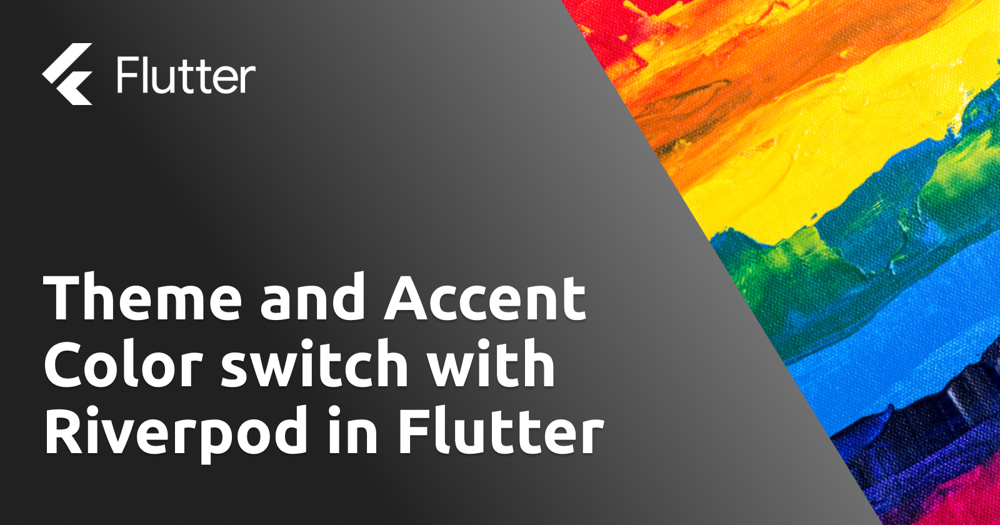
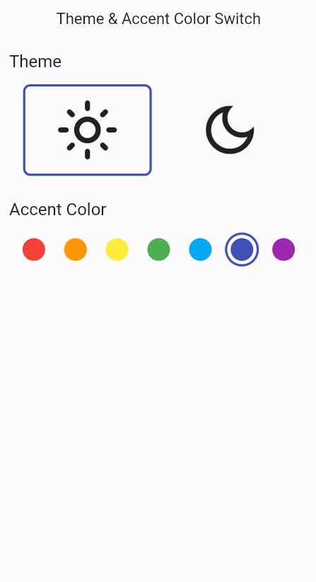
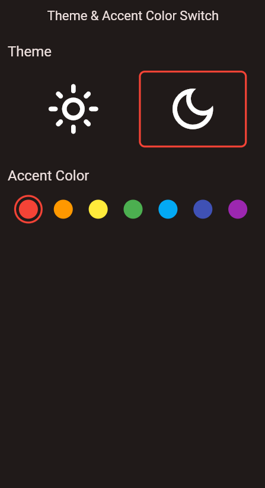

# Theme and Accent Color Switch



Simple Flutter Desktop app to demonstrate how to use riverpod to manage the dark and light theme change and accent color to be used within the application.

| Light Mode                            | Dark Mode                            |
| ------------------------------------- | ------------------------------------ |
|  |  |

You can find the full article on: [Theme and Accent Color switch with Riverpod in Flutter](https://blog.albertobonacina.com/theme-and-accent-color-switch-with-riverpod-in-flutter)

## 🔗 Useful Links

* [StateProvider on Riverpod Docs](https://riverpod.dev/docs/providers/state_provider)
  
## 💎 Contributing

If you have any idea, feel free to fork it and submit your changes back to me. 
Found a bug? create an [issue](https://github.com/polilluminato/theme-accent-color-switch-flutter/issues) to help me improve the project.

## 📋 License

```
Copyright 2023 Alberto Bonacina

Licensed under the Apache License, Version 2.0 (the "License");
you may not use this file except in compliance with the License.
You may obtain a copy of the License at

   http://www.apache.org/licenses/LICENSE-2.0

Unless required by applicable law or agreed to in writing, software
distributed under the License is distributed on an "AS IS" BASIS,
WITHOUT WARRANTIES OR CONDITIONS OF ANY KIND, either express or implied.
See the License for the specific language governing permissions and
limitations under the License.
```
